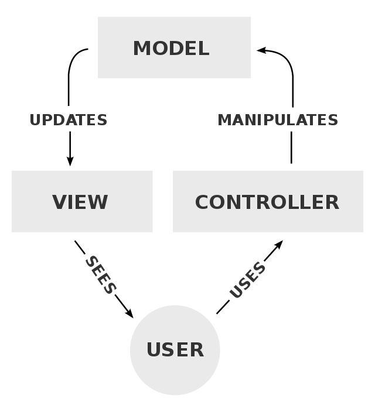
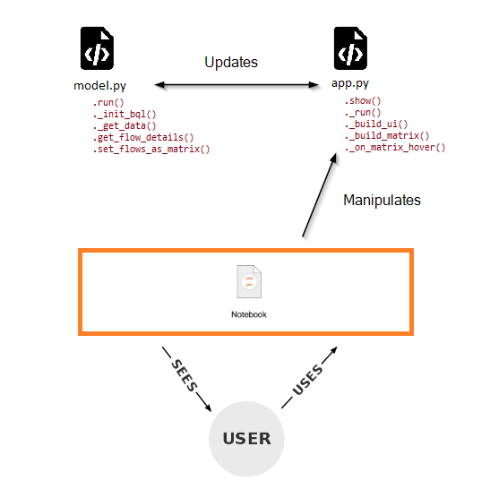

# BQuant Lab | Session #2
## App Building

Objective of this session is to build a heatmap using the tools that BQuant Platform can provide. 

We'll split the App creation into 2 parts:
* definition of the `DataModel`, responsible for the data acquisition
* definition of the `App`, where all the graphics and the user interaction goes.

Note that we will use a <a href="https://www.wikiwand.com/en/Model%E2%80%93view%E2%80%93controller">MVC framework</a> (Model-View-Controller) to best implement this Application. 

<table border="0">
<tr><td></td>
    <td>We'll adapt this framework  to design our App as per follows:</td>
    <td></td>
</tr>
</table>

## Content

As we will go over this step-by-step, you will be going over the following procedure:

* `02. Define model.ipynb`: you will first go through the data acquisition with a concrete example for Fixed Income and one for Equity. 
At the end of this notebook, you will have retrieved the necessary data to build our heatmap, and build a specific method to yield the data the way we need for the heatmap.

* `03. Testing model.ipynb`: you will test the content stored into a .py file for modularity purposes.  
At the end of this model, you will have created a `model.py` file that will store the necessary requests for your `DataModel`.

### We'll reiterate this for the visuals:
* `04. Testing the App UI.ipynb`: you will implement some general graphical interface setup. 
The necessary input objects to guarantee enough interactivity for the end-user. This will include a label, a dropdown, a button, a ticker autocomplete objects. 

* `05. Main App.ipynb`: this notebook will hold the final App version.  
This light notebook will be calling `app.py` to initialize the main interface. 
